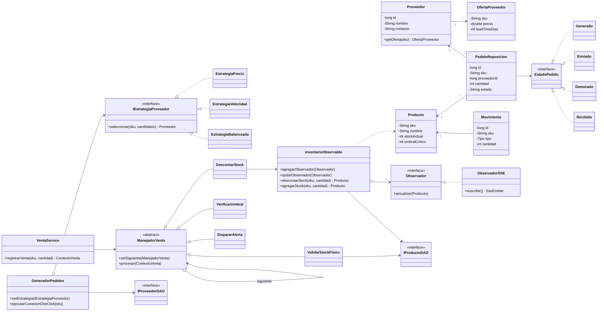

# UML de clases

Diagrama de clases del back (Strategy, Observer, Chain of Responsibility, State y DAO).
Incluye `EstrategiaBalanceada`, que el diagrama del PDF no mostraba.

```mermaid
classDiagram
    direction LR

    class Producto {
        -String sku
        -String nombre
        -int stockActual
        -int umbralCritico
    }
    class Proveedor {
        -long id
        -String nombre
        -String contacto
        +getOferta(sku) OfertaProveedor
    }
    class OfertaProveedor {
        -String sku
        -double precio
        -int leadTimeDias
    }
    class PedidoReposicion {
        -long id
        -String sku
        -long proveedorId
        -int cantidad
        -String estado
    }
    class Movimiento {
        -long id
        -String sku
        -Tipo tipo
        -int cantidad
    }
    Proveedor "1" --> "*" OfertaProveedor
    Producto "1" <-- "*" Movimiento
    Producto "1" <-- "*" PedidoReposicion
    Proveedor "1" <-- "*" PedidoReposicion

    %% Strategy
    class IEstrategiaProveedor {
        <<interface>>
        +seleccionar(sku, candidatos) Proveedor
    }
    class EstrategiaPrecio
    class EstrategiaVelocidad
    class EstrategiaBalanceada
    class GeneradorPedidos {
        +setEstrategia(IEstrategiaProveedor)
        +ejecutarConexionOneClick(sku)
    }
    IEstrategiaProveedor <|.. EstrategiaPrecio
    IEstrategiaProveedor <|.. EstrategiaVelocidad
    IEstrategiaProveedor <|.. EstrategiaBalanceada
    GeneradorPedidos o--> IEstrategiaProveedor

    %% Observer
    class Observador {
        <<interface>>
        +actualizar(Producto)
    }
    class InventarioObservable {
        +agregarObservador(Observador)
        +quitarObservador(Observador)
        +descontarStock(sku, cantidad) Producto
        +agregarStock(sku, cantidad) Producto
    }
    class ObservadorSSE {
        +suscribir() SseEmitter
    }
    Observador <|.. ObservadorSSE
    InventarioObservable o--> "*" Observador
    InventarioObservable ..> Producto

    %% Chain of Responsibility
    class ManejadorVenta {
        <<abstract>>
        +setSiguiente(ManejadorVenta)
        +procesar(ContextoVenta)*
    }
    class ValidarStockFisico
    class DescontarStock
    class VerificarUmbral
    class DispararAlerta
    class VentaService {
        +registrarVenta(sku, cantidad) ContextoVenta
    }
    ManejadorVenta <|-- ValidarStockFisico
    ManejadorVenta <|-- DescontarStock
    ManejadorVenta <|-- VerificarUmbral
    ManejadorVenta <|-- DispararAlerta
    ManejadorVenta o--> ManejadorVenta : siguiente
    VentaService --> ManejadorVenta
    DescontarStock --> InventarioObservable

    %% State
    class EstadoPedido {
        <<interface>>
    }
    class Generado
    class Enviado
    class Demorado
    class Recibido
    EstadoPedido <|.. Generado
    EstadoPedido <|.. Enviado
    EstadoPedido <|.. Demorado
    EstadoPedido <|.. Recibido
    PedidoReposicion --> EstadoPedido

    %% DAO
    class IProductoDAO {
        <<interface>>
    }
    class IProveedorDAO {
        <<interface>>
    }
    ValidarStockFisico --> IProductoDAO
    InventarioObservable --> IProductoDAO
    GeneradorPedidos --> IProveedorDAO
```
